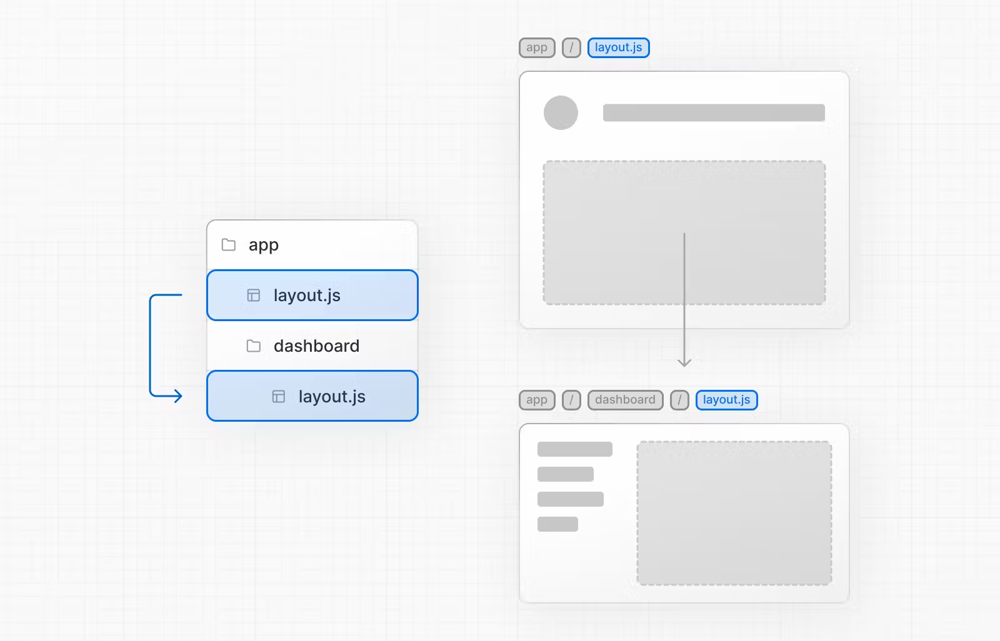
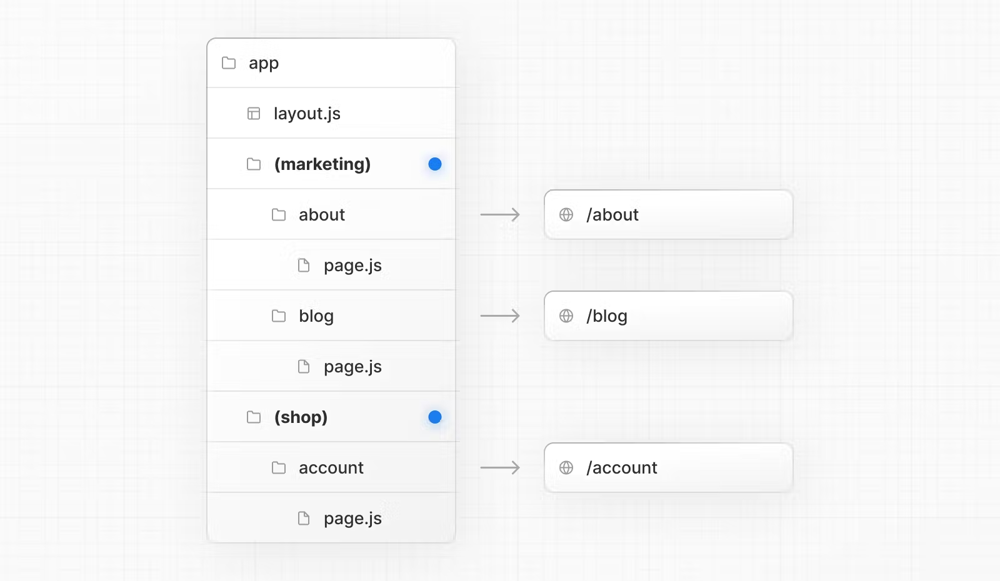

# Layout

## Nesting Layout

- 기본적으로 Layout은 파일 구조에 따라 중첩된다 . 즉, children prop을 통해 하위 레이아웃을 래핑한다.
  
  - 이로인해 Root Layout은 `html`과 `body`를 포함해야한다.
  - layout 래핑을 피하기 위해서는 Route Group을 설정하면 된다.

## Route Group

- URL 주소에 영향을 끼치지 않으면서 route를 구조화 하고 싶다면 Route Group을 사용하면된다. 아래 이미지는 marketing과 shop 관련 route를 나누어 구조화 하였다.
  

  - 같은 레벨의 Route Group내 layout을 각자 설정할 수 있으며 이 둘은 서로에게 영향을끼치지 않는다.
